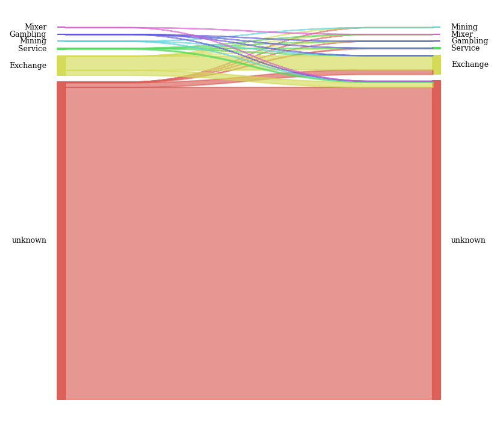
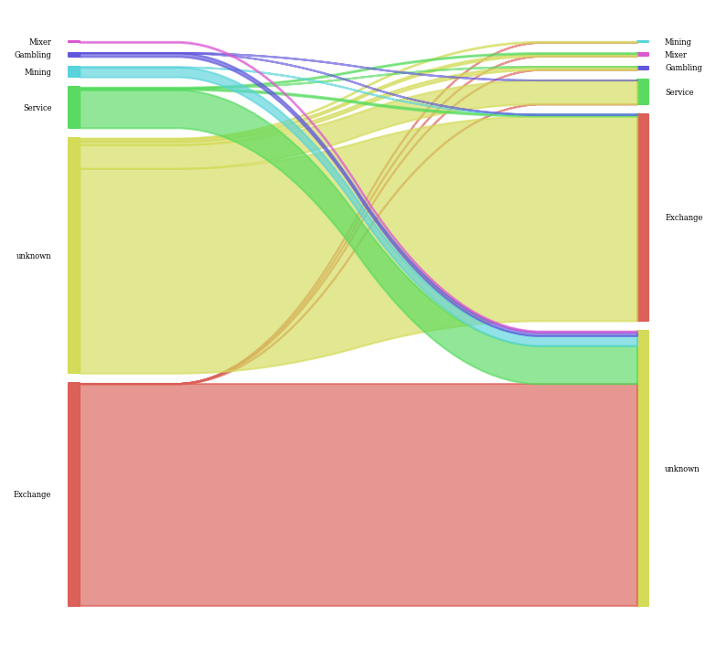
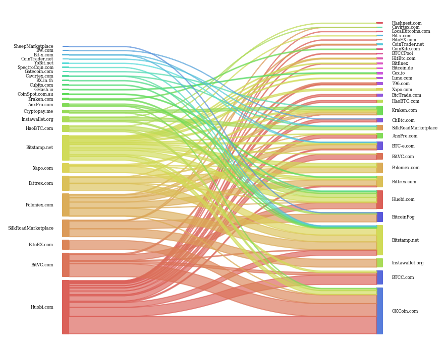

[](http://quantlet.de/)

## [](http://quantlet.de/) **BTC_ANA_data_collection** [](http://quantlet.de/)

```yaml


Name of Quantlet: 'BTC_ANA_data_collection'

Published in: 'DEDA_Class_2019WS'

Description: 'Scraping and preprocessing of labeled btc addresses from differen websites.
Collection of specified transactions from a full bitcoin blockchain node hosted on Google Big Query'

Keywords: 'Scraping, Bitcoin, Blockchain, Transactions, BigQuery'

Author: 'David Steiner, Minh Nguyen'

See also: 'https://github.com/DavidDanielSteiner/btc_blockchain_analytics'

Submitted:  '28. Jan 2020'

Datafile: 'to be updated'


```







### PYTHON Code
```python

# -*- coding: utf-8 -*-
"""
Created on Tue Dec 10 16:38:40 2019

@author: David
"""

import pandas as pd
import numpy as np

# =============================================================================
# Scrape labeled addresses
# !Please run scripts manually due to very long runtime!
# =============================================================================

'''
#WalletExplorer.com (20 mio addresses for categories Exchange, Service, Pool, Gambling, Historic)
#--> sraper_walletexplorer.py

#Bitinfocharts.com 
#--> scraper_bitinfocharts.py (top 10.000 BTC adresses)
#--> scraper_bitinfocharts_tor.py (scrape specific addresses one by one. TOR Browser neccessary)

#Cryptoground
#--> Scrape specific addresses for Mt.Gox Exchange
'''

# =============================================================================
# Preprocess and merge all addresses from different data sources
# !Please run scripts manually due to very long runtime!
# =============================================================================

#-->wallet_preprocessing.py

# =============================================================================
# Get all transactions over a specific value of btc
# =============================================================================
from bigquery_btc_node import get_all_tx_over_value

btc=100
large_tx = get_all_tx_over_value(btc)
large_tx.to_csv("transactions_" + str(btc) +"BTC.csv", index=False)

# =============================================================================
# Get complete transaction history for samples of addresses per category
# !GOOGLE DEVELOPER CREDENTIALS NECCESSARY!
# =============================================================================
from bigquery_btc_node import get_all_tx_from_address

df = pd.read_csv("../data/btc_wallets.csv")

exchange = df[df['category'] == 'Exchange'].sample(n=10000, random_state = 1)['address'].to_list()
gambling = df[df['category'] == 'Gambling'].sample(n=10000, random_state = 1)['address'].to_list()
service = df[df['category'] == 'Service'].sample(n=10000, random_state = 1)['address'].to_list()
mixer = df[df['category'] == 'Mixer'].sample(n=10000, random_state = 1)['address'].to_list()
mining = df[df['category'] == 'Mining'].sample(n=10000, random_state = 1)['address'].to_list()

category_list = [exchange, gambling, service, mixer, mining]
category_names = ['Exchange','Gambling','Service','Mixer','Mining']

for address_list, category_name in zip(category_list, category_names):
    all_tx = get_all_tx_from_address(address_list)
    all_tx['category'] = category_name    
    all_tx.to_csv("address_" + category_name + ".csv", index=False)
    print(category_name, "saved to csv", sep=" ")


# =============================================================================
# Get complete transaction history for unknown addresses
# Addresses will be processed in bulk for memory issues
# !GOOGLE DEVELOPER CREDENTIALS NECCESSARY!
# =============================================================================
address_df = pd.read_csv("../data/addresses_unknown.csv")

df_split = np.array_split(df, 10)

i=0
for address_list in df_split:
    i += 1
    address_list = address_list['address'].to_list()
    all_tx = get_all_tx_from_address(address_list)
    all_tx.to_csv("address_unknown_chunk_" + str(i) + ".csv", index=False)
    print(str(i) + "chunks saved to csv")

```

automatically created on 2020-02-03