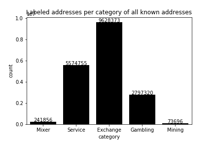
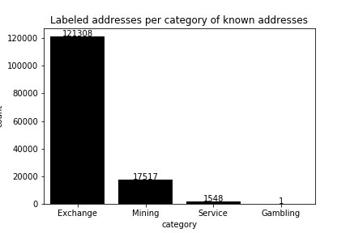
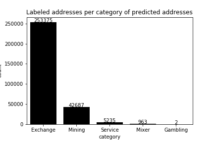

[](http://quantlet.de/)

## [](http://quantlet.de/) **BTC_ANA_data_exploration** [](http://quantlet.de/)

```yaml


Name of Quantlet: 'BTC_ANA_data_exploration'

Published in: 'DEDA_Class_2019WS'

Description: 'Exploration of Scraped Addresses, Transaction Flow (Sankey Diagram), Transaction and Category Details,
Time Series Chart and Transaction Categories. As well as analyzing the impact of different transaction categories on the Bitcoin Price through different metrics'

Keywords: 'Bitcoin, Blockchain, Transactions, Data Exploration, Data Visualization, Metrics, Sankey Diagram'

Author: 'David Steiner, Minh Nguyen'

See also: 'https://github.com/DavidDanielSteiner/btc_blockchain_analytics'

Submitted:  '28. Jan 2020'

Datafile: 'to be updated'


```








### PYTHON Code
```python

# -*- coding: utf-8 -*-
"""
Created on Mon Nov 18 20:57:26 2019

@author: David

"""

import pandas as pd
import seaborn as sns
import matplotlib.pyplot as plt
import requests
import io

# =============================================================================
# LABELS / WALLETS
# =============================================================================
wallets_all = pd.read_csv("../data/btc_wallets_new.csv", index_col=False)
wallets_predicted = pd.read_csv("../data/btc_wallets_predicted.csv", index_col=False)
wallets_known = pd.read_csv("../data/addresses_known_0.01_marketcap_2015-2020.csv", index_col=False)
wallets_known = pd.merge(wallets_known, wallets_all, on='address')
wallets = wallets_all.append(wallets_predicted)
wallets = wallets.drop_duplicates(subset='address', keep='first')


#Statistics to all scraped wallets
stats_wallets_all_categories = wallets_all.groupby(['category']).agg(
            addresses=('address', 'count'),
            entities =('owner', 'nunique')).sort_values(by=['addresses'], ascending=False)

with open('all_wallets_stats_1.tex','w') as tf:
    tf.write(stats_wallets_all_categories.to_latex())


tmp = wallets_all[['owner', 'address']]
stats_wallets_all_owners = tmp.groupby(['owner']).agg(['count'], as_index=False).reset_index()

#Addresses per owner
plt.figure(figsize = (15,40))
order = wallets_all['address'].value_counts(ascending=False).index
sns.countplot(y='owner', data=wallets_all, order = order) 
plt.savefig('addresses_per_owner.png', transparent=True)


#Statistics to all relevant wallets (scraped and predicted)

#Addresses per category known
fig, ax = plt.subplots()
graph = sns.countplot(x='category', data=wallets_known, color="black")
plt.title('Labeled addresses per category of known addresses')
graph.set_xticklabels(graph.get_xticklabels())
for p in graph.patches:
    height = p.get_height()
    graph.text(p.get_x()+p.get_width()/2., height + 0.1,height ,ha="center")
plt.savefig('addresses_known_labeled_category.png', transparent=True)

#Addresses per category predicted
fig, ax = plt.subplots()
graph = sns.countplot(x='category', data=wallets_predicted, color="black")
plt.title('Labeled addresses per category of predicted addresses')
graph.set_xticklabels(graph.get_xticklabels())
for p in graph.patches:
    height = p.get_height()
    graph.text(p.get_x()+p.get_width()/2., height + 0.1,height ,ha="center")
plt.savefig('addresses_predicted_labeled_category.png', transparent=True)

#Addresses per category all
fig, ax = plt.subplots()
graph = sns.countplot(x='category', data=wallets_all, color="black")
plt.title('Labeled addresses per category of all known addresses')
graph.set_xticklabels(graph.get_xticklabels())
for p in graph.patches:
    height = p.get_height()
    graph.text(p.get_x()+p.get_width()/2., height + 0.1,height ,ha="center")
plt.savefig('addresses_all_labeled_category.png', transparent=True)


# =============================================================================
# Transactions                
# =============================================================================
def merge_tnx_wallets(tnx, wallets):
    tnx = tnx.drop(['sender_name', 'sender_category', 'receiver_name', 'receiver_category'], axis=1)
    wallets = wallets.drop_duplicates(subset='address', keep='last')
     
    sender = pd.merge(tnx, wallets, left_on='sender', right_on='address', how='left')
    sender.rename(columns = {"owner": "sender_name", "category":"sender_category"}, inplace = True) 
    sender = sender.drop(['address'], axis=1)    
    
    receiver = pd.merge(tnx, wallets, left_on='receiver', right_on='address', how='left')
    receiver.rename(columns = {"owner": "receiver_name", "category":"receiver_category"}, inplace = True) 
    receiver = receiver.drop(['address'], axis=1)
    
    tnx = pd.merge(sender, receiver,  how='inner', on=['hash', 'block_timestamp', 'sender','receiver', 'date', 'btc', 'dollar', 'percent_marketcap', 'PriceUSD'])
 
    return tnx

tnx = pd.read_csv("../data/transactions_0.01_marketcap_2015-2020.csv", index_col=False) #1019673

#Preprocessing
tnx["btc"] = tnx["btc"].astype(int)
tnx["dollar"] = tnx["dollar"].astype(int)
tnx['block_timestamp'] = pd.to_datetime(tnx['block_timestamp']) 
tnx['date'] = pd.to_datetime(tnx['block_timestamp']).apply(lambda x: '{year}-{month}-{day}'.format(year=x.year, month=x.month, day=x.day))   
tnx = merge_tnx_wallets(tnx, wallets) #1.029 mio addresses
tnx = tnx.groupby(['hash'], as_index=False).first() #121023 transactions

# =============================================================================
# Remove Self Transactions
# =============================================================================
'''transactions with single sender / self transactions'''
#self transactions
tmp = tnx[tnx.groupby('hash')['sender'].transform('size') == 1]
self_transactions = tmp[tmp['sender'] == tmp['receiver']] #43484 self transactions

sns.countplot(x='receiver_category', data=self_transactions) 
sns.countplot(y='receiver_name', data=self_transactions, order= self_transactions['receiver_name'].value_counts(ascending=False).index) 
sns.boxplot(x=self_transactions["dollar"], y=self_transactions["receiver_name"], showfliers=False, order = self_transactions.groupby("receiver_name")["dollar"].median().fillna(0).sort_values()[::-1].index) 

#Scatterplot (Date, Dollar, BTC)
plt.figure(figsize = (20,20))
plt.xlim(self_transactions['block_timestamp'].min(), self_transactions['block_timestamp'].max())
cmap = sns.cubehelix_palette(dark=.3, light=.8, as_cmap=True)
ax = sns.scatterplot(x="block_timestamp", y="dollar",
                      hue="receiver_category", size="btc",
                      palette="Set2",
                      data=self_transactions)

'''grouped transactions without self transactions'''
tnx_all = tnx.groupby(['hash'], as_index=False).first()
tnx = pd.concat([tnx_all, self_transactions]).drop_duplicates(keep=False)


# =============================================================================
# Sankey diagram
# =============================================================================
from pySankey import sankey

#tnx = pd.read_csv("../data/tmp/transactions_100BTC_labeled.csv", index_col=False) #1019673
#tnx = tnx.fillna('unknown') 
tnx.dtypes

mode="filtered_transactions"
#mode="100BTC"
filt = 'predicted'
#filt = 'unknown'

#Sankey diagram per entity
grouped = tnx.groupby(['hash'], as_index=False)[ 'sender_name', 'receiver_name', 'sender_category', 'receiver_category'].agg(['min']).reset_index() #n_transactions = 6.92 mio
grouped.columns = ['hash', 'sender_name', 'receiver_name', 'sender_category', 'receiver_category']
df = grouped[['hash', 'sender_name', 'receiver_name']]
df = df.groupby(['sender_name', 'receiver_name'], as_index=False).agg(['count']).reset_index()
df.columns = ['sender_name', 'receiver_name', 'count']

df1 = df.sort_values(by=['count'], ascending=False).reset_index(drop=True)
df1=df1[df1['count'] >= 10]
plt.figure(figsize = (20,20))
sankey.sankey(
    left=df1['sender_name'], right=df1['receiver_name'], rightWeight=df1['count'],  leftWeight=df1['count'], aspect=5,
    fontsize=4, figure_name="sankey_" + mode + "_entity")

df2 = df[df['sender_name'] != df['receiver_name']]
df2 = df2.sort_values(by=['count'], ascending=False).reset_index(drop=True)
sankey.sankey(
    left=df2['sender_name'], right=df2['receiver_name'], rightWeight=df2['count'],  leftWeight=df2['count'], aspect=1,
    fontsize=4, figure_name="sankey_" + mode + "_entity_without_self_transactions")

df2 = df[(df['sender_name'] != filt) & (df['receiver_name'] != filt)]
df2 = df2.sort_values(by=['count'], ascending=False).reset_index(drop=True)
sankey.sankey(
    left=df2['sender_name'], right=df2['receiver_name'], rightWeight=df2['count'],  leftWeight=df2['count'], aspect=1,
    fontsize=4, figure_name="sankey_" + mode + "_entity_without_unknown")

df2 = df2[df2['sender_name'] != df2['receiver_name']]
df2 = df2.sort_values(by=['count'], ascending=False).reset_index(drop=True)
sankey.sankey(
    left=df2['sender_name'], right=df2['receiver_name'], rightWeight=df2['count'],  leftWeight=df2['count'], aspect=1,
    fontsize=4, figure_name="sankey_" + mode + "_entity_without_unknown_and_self_transactions")

df2= df2[df2['count'] >= 10]
df2 = df2.sort_values(by=['count'], ascending=False).reset_index(drop=True)
sankey.sankey(
    left=df2['sender_name'], right=df2['receiver_name'], rightWeight=df2['count'],  leftWeight=df2['count'], aspect=1,
    fontsize=4, figure_name="sankey_" + mode + "_entity_without_unknown_and_self_transactions_and_10")


#Sankey diagram per category
df = grouped[['hash','sender_category', 'receiver_category']]
df = df.groupby(['sender_category', 'receiver_category'], as_index=False).agg(['count']).reset_index()
df.columns = ['sender_category', 'receiver_category', 'count']

df3 = df
df3 = df3.sort_values(by=['count'], ascending=False).reset_index(drop=True)
sankey.sankey(
    left=df3['sender_category'], right=df3['receiver_category'], rightWeight=df3['count'],  leftWeight=df3['count'], aspect=5,
    fontsize=6, figure_name="sankey_" + mode + "_category")

df4 = df[(df['sender_category'] != filt) & (df['receiver_category'] != filt)]
df4 = df4.sort_values(by=['count'], ascending=False).reset_index(drop=True)
sankey.sankey(
    left=df4['sender_category'], right=df4['receiver_category'], rightWeight=df4['count'],  leftWeight=df4['count'], aspect=5,
    fontsize=6, figure_name="sankey_" + mode + "_category_without_unknown")

df4 = df[df['sender_category'] != df['receiver_category']]
df4 = df4.sort_values(by=['count'], ascending=False).reset_index(drop=True)
sankey.sankey(
    left=df4['sender_category'], right=df4['receiver_category'], rightWeight=df4['count'],  leftWeight=df4['count'], aspect=5,
    fontsize=4, figure_name="sankey_" + mode + "_category_without_self_transactions")

df4 = df4[df4['sender_category'] != df4['receiver_category']]
df4 = df4.sort_values(by=['count'], ascending=False).reset_index(drop=True)
sankey.sankey(
    left=df4['sender_category'], right=df4['receiver_category'], rightWeight=df4['count'],  leftWeight=df4['count'], aspect=5,
    fontsize=4, figure_name="sankey_" + mode + "_category_without_unknown_and_self_transactions")


# =============================================================================
# Exploration
# =============================================================================
#Total Transactions per category
fig, ax = plt.subplots()
graph = sns.countplot(x='receiver_category', data=tnx) 
plt.title('Receiver addresses of all transactions > 10mio US$')
graph.set_xticklabels(graph.get_xticklabels())
for p in graph.patches:
    height = p.get_height()
    graph.text(p.get_x()+p.get_width()/2., height + 0.1,height ,ha="center")
plt.savefig('transactions_category_all.png', transparent=True)

#Valid Transactions per category
fig, ax = plt.subplots()
graph = sns.countplot(x='receiver_category', data=tnx) 
plt.title('Receiver addresses of valid transactions > 10mio US$ per category')
graph.set_xticklabels(graph.get_xticklabels())
for p in graph.patches:
    height = p.get_height()
    graph.text(p.get_x()+p.get_width()/2., height + 0.1,height ,ha="center")
plt.savefig('transactions_category_valid.png', transparent=True)


#Dollar value per category
ax = sns.boxplot(x=tnx["receiver_category"], y=tnx["dollar"], showfliers=False) 

#Receiver transactions per owner
fig, ax1 = plt.subplots(figsize=(20,10))
graph = sns.countplot(ax=ax1,x='receiver_name', data=tnx, order= tnx['receiver_name'].value_counts(ascending=False).index)
graph.set_xticklabels(graph.get_xticklabels(),rotation=90)
for p in graph.patches:
    height = p.get_height()
    graph.text(p.get_x()+p.get_width()/2., height + 0.1,height ,ha="center")


#Distribution of transactions dollar value
plt.figure(figsize = (10,10))
sns.boxplot(x=tnx["dollar"], y=tnx["receiver_name"], order = tnx.groupby("receiver_name")["dollar"].median().fillna(0).sort_values()[::-1].index) 
plt.figure(figsize = (10,10))
sns.boxplot(x=tnx["dollar"], y=tnx["receiver_name"], showfliers=False, order = tnx.groupby("receiver_name")["dollar"].median().fillna(0).sort_values()[::-1].index) 

#Distribution of transactions market cap value
plt.figure(figsize = (10,10))
sns.boxplot(x=tnx["percent_marketcap"], y=tnx["receiver_name"], order = tnx.groupby("receiver_name")["percent_marketcap"].median().fillna(0).sort_values()[::-1].index) 
sns.boxplot(x=tnx["receiver_category"], y=tnx["percent_marketcap"], showfliers=False)

#Scatterplot (Date, Dollar, BTC)
plt.figure(figsize = (20,20))
#plt.xlim(tnx_valid['block_timestamp'].min(), tnx_valid['block_timestamp'].max())
plt.xlim(pd.to_datetime('2015-01-01 00:00:00+00:00'), tnx['block_timestamp'].max())
cmap = sns.cubehelix_palette(dark=.3, light=.8, as_cmap=True)
ax = sns.scatterplot(x="block_timestamp", y="dollar",
                      hue="receiver_category", size="btc",
                      palette="Set2",
                      data=tnx)


# =============================================================================
# Transaction type
# =============================================================================
'''categorize by transactions type'''

date_start = '2015-01-01'
date_end = '2020-01-01'
all_days = pd.date_range(date_start, date_end, freq='D')

def preprocess_transaction_types(df, category):
    df['date'] = pd.to_datetime(df['date'])
    df = df[df['percent_marketcap'] >= 0.02]
    df = df.groupby(['date']).sum()
    df = df[df['percent_marketcap'] < 10]
    df = df.reindex(all_days)
    df['category'] = category     
    df = df.fillna(0)    
    return df


#tnx_valid.columns.values
tmp = tnx[['hash', 'date', 'dollar','percent_marketcap', 'sender_name', 'receiver_name', 'sender_category', 'receiver_category']]

all_all = preprocess_transaction_types(tmp, 'all')
exchange_exchange = preprocess_transaction_types(tmp[(tmp['sender_category'] == 'Exchange') &  (tmp['receiver_category'] == 'Exchange')], 'exchange_exchange')
other_exchange = preprocess_transaction_types(tmp[(tmp['sender_category'] != 'Exchange') &  (tmp['receiver_category'] == 'Exchange')], 'other_exchange')
exchange_other = preprocess_transaction_types(tmp[(tmp['sender_category'] == 'Exchange') &  (tmp['receiver_category'] != 'Exchange')], 'exchange_other')
other_other = preprocess_transaction_types(tmp[(tmp['sender_category'] != 'Exchange') &  (tmp['receiver_category'] != 'Exchange')], 'other_other')


#Addresses per category  
tnx_category = pd.concat([exchange_exchange, other_exchange, exchange_other, other_other])
fig, ax = plt.subplots()
graph = sns.countplot(x='category', data=tnx_category)
plt.title('Transactions per transaction category')
graph.set_xticklabels(graph.get_xticklabels())
for p in graph.patches:
    height = p.get_height()
    graph.text(p.get_x()+p.get_width()/2., height + 0.1,height ,ha="center")
plt.savefig('transaction_types.png', transparent=True)


#scatterplot by transaction type
tmp = tnx_category.reset_index().dropna()
tmp.rename(columns = {"index": "date"}, inplace = True) 
plt.figure(figsize = (20,20))
plt.xlim(pd.to_datetime('2015-01-01 00:00:00+00:00'), tmp['date'].max())
ax = sns.scatterplot(x="date", y="dollar",
                      hue="category",
                      palette="Set1",
                      alpha=.5, 
                      data=tmp)

#scatterplots by transaction type
sns.set(style="ticks", color_codes=True)
g = sns.FacetGrid(tmp, col="category", palette="GnBu_d", size=5, aspect=1.5)
g.map(plt.scatter, "date", "dollar", alpha=.1)
g.add_legend()


# =============================================================================
# Price data
# =============================================================================
def get_price_data():
    response=requests.get('https://coinmetrics.io/newdata/btc.csv').content
    price = pd.read_csv(io.StringIO(response.decode('utf-8')))
    price['date'] = pd.to_datetime(price['date'])
    price.set_index('date', inplace=True)
    price = price[['PriceUSD']]
    price['return'] = price.pct_change(1) * 100
    
    response=requests.get('https://www.cryptodatadownload.com/cdd/Bitstamp_BTCUSD_d.csv', verify=False).content
    response = response.decode('utf-8')
    response = "\n".join(response.split("\n")[1:])
    price_2 = pd.read_csv(io.StringIO(response))
    price_2['volatility'] = (1 - (price_2['Low'] / price_2['High'])) * 100
    price_2['date'] = pd.to_datetime(price_2['Date'])
    price_2.set_index('date', inplace=True)   
    price = price.join(price_2)
    price = price.loc[date_start:date_end]
    price['dif_high_close'] = ((price['High'] - price['Close']) / price['Close']) * 100
    return price

price = get_price_data()
 
# =============================================================================
# Time Series Chart
# =============================================================================
plt.figure(figsize=(15,19))
price_top = plt.subplot2grid((10,4), (0, 0), rowspan=2, colspan=4)
volatility = plt.subplot2grid((10,4), (2, 0), rowspan=1, colspan=4)
change_daily = plt.subplot2grid((10,4), (3, 0), rowspan=1, colspan=4)
tnx_vol_1 = plt.subplot2grid((10,4), (4,0), rowspan=1, colspan=4)
tnx_vol_2 = plt.subplot2grid((10,4), (5,0), rowspan=1, colspan=4)
tnx_vol_3 = plt.subplot2grid((10,4), (6,0), rowspan=1, colspan=4)
tnx_vol_4 = plt.subplot2grid((10,4), (7,0), rowspan=1, colspan=4)

price_top.plot(price.index, price['PriceUSD']) 
volatility.plot(price.index, price['volatility']) 
change_daily.plot(price.index, price['return']) 
change_daily.axhline(y=0, color='r', linestyle='-')

tnx_vol_1.plot(other_exchange.index, other_exchange['percent_marketcap']) 
tnx_vol_2.plot(exchange_other.index, exchange_other['percent_marketcap']) 
tnx_vol_3.plot(other_other.index, other_other['percent_marketcap']) 
tnx_vol_4.plot(exchange_exchange.index, exchange_exchange['percent_marketcap']) 

price_top.set_title('Value of BTC transactions per category (in percent of btc marketcap, aggregated per day)')
price_top.set_ylabel('Closing Price')
volatility.set_ylabel('Daily Volatility')
change_daily.set_ylabel('Daily Return')
tnx_vol_1.set_ylabel('other_exchange')
tnx_vol_2.set_ylabel('exchange_other')
tnx_vol_3.set_ylabel('other_other')
tnx_vol_4.set_ylabel('exchange_exchange')

change_daily.axes.get_xaxis().set_visible(False)
volatility.axes.get_xaxis().set_visible(False)
tnx_vol_1.axes.get_xaxis().set_visible(False)
tnx_vol_2.axes.get_xaxis().set_visible(False)
tnx_vol_3.axes.get_xaxis().set_visible(False)

plt.savefig('transaction_types_chart.png', transparent=True)  


# =============================================================================
# Analysis, Metrics
# =============================================================================
from datetime import timedelta

def analytics(df, price, mode='normal'):   
    n_days, return_m, return_0,return_1,return_2,vola_m,vola_0,vola_1,vola_2,diff_m,diff_0,diff_1,diff_2 = ([] for i in range(13))
    col_names = []
    index_name = [] 
    
    col_names.extend(['cases', 'return-1', 'return_0', 'return_1', 'return_2', 'vola-1', 'vola_0', 'vola_1', 'vola_2', 'dif-1','diff_0', 'diff_1', 'diff_2'])
   
    if mode == 'average':
        index_name.append('AVERAGE')       
    else:        
        transaction_category = df['category'][0]
        index_name.append(str(transaction_category))
   
    for day in range(-1,3):      
        if mode == 'average':
            return_whale = price['return'].mean()
            vola_whale = price['volatility'].mean()
            diff_whale = price['dif_high_close'].mean()
            
            tx = len(df)
            n_days.extend([tx])
            
          
        else:    
            df['date'] = df.index + timedelta(days=day)
            tmp = pd.merge(df, price, left_on='date', right_index=True, how='inner')
        
            whale = tmp[tmp['dollar'] != 0]        
            return_whale = whale['return'].mean()
            vola_whale = whale['volatility'].mean()
            diff_whale = whale['dif_high_close'].mean()
            
            tx = len(tmp[tmp['dollar'] != 0])
            n_days.extend([tx])


        if day == -1:
            return_m.extend([return_whale])
            vola_m.extend([vola_whale])
            diff_m.extend([diff_whale])
    
        if day == 0:
            return_0.extend([return_whale])
            vola_0.extend([vola_whale])
            diff_0.extend([diff_whale])
                    
        elif day == 1:
            return_1.extend([return_whale])
            vola_1.extend([vola_whale])
            diff_1.extend([diff_whale])
            
        elif day == 2:
            return_2.extend([return_whale])
            vola_2.extend([vola_whale])
            diff_2.extend([diff_whale])
    
    result = pd.DataFrame(list(zip(n_days, return_m,return_0, return_1, return_2,vola_m, vola_0, vola_1, vola_2, diff_m, diff_0, diff_1, diff_2)), index = index_name, columns = col_names) 
    return result
    

df = pd.DataFrame()
df = df.append(analytics(all_all, price, mode='average'))
df = df.append(analytics(other_exchange, price))
df = df.append(analytics(exchange_other, price))
df = df.append(analytics(exchange_exchange, price))
df = df.append(analytics(other_other, price))


with open('final_metrics.tex','w') as tf:
    tf.write(df.to_latex())
```

automatically created on 2020-02-03