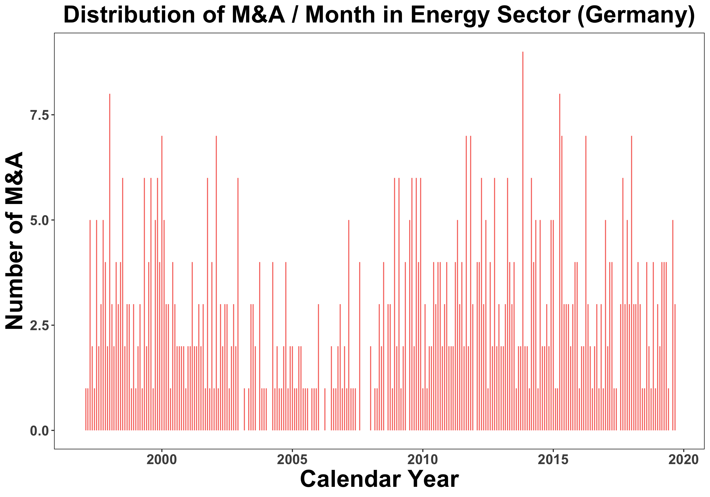
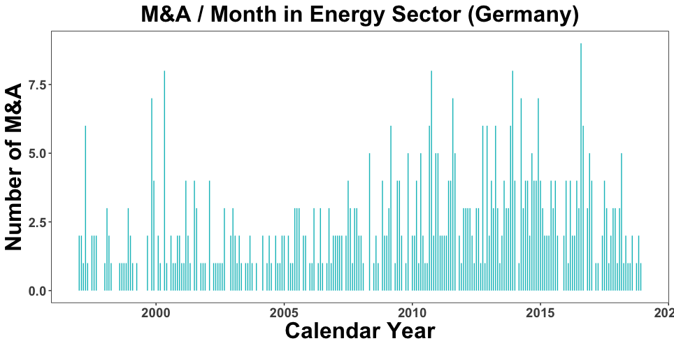

[](http://quantlet.de/)

## [](http://quantlet.de/) **DEDA_RealVsPoissonMA** [](http://quantlet.de/)

```yaml

Name of QuantLet : 'DEDA_RealVsPoissonMA'

Published in : 'Digital Economy & Decision Analysis' 

Description : 'Analyzes mergers & acquisitions on the German energy market, including approximation with Poisson distributions with time varying lambdas'

Keywords : 'mergers & acquisitions, mergers, acquisitions, deals, poisson, time series, decomposition, forecasting, prediction, economics, estimation, adaptive parameters'

Author : 'Danial Florian Saef and Kainat Khowaja'

```





### R Code
```r

# clear variables and close windows
rm(list = ls(all = TRUE))
graphics.off()

library(data.table)
library(lubridate)
library(xts)
library(forecast)
library(ggplot2)
library(rugarch)

## settings ##
Sys.setenv(LANG = "en") # set environment language to English
Sys.setlocale("LC_TIME", "en_US.UTF-8") # set timestamp language to English
## ##

## themes & functions ##
#
ts_theme <- theme(panel.border = element_blank(), panel.background = element_blank(),
                  panel.grid.minor = element_line(colour = "grey90"),
                  panel.grid.major = element_line(colour = "grey90"),
                  axis.text = element_text(size = 14, face = "bold"),
                  axis.title = element_text(size = 24, face = "bold"),
                  strip.text = element_text(size = 14, face = "bold"),
                  plot.title = element_text(size = 24, face = "bold", hjust = .5)
)
#

# Changing strings to numerics
strip <- function(x){
  z <- gsub("[^0-9,.]", "", x)
  z <- gsub("\\.", "", z)
  gsub(",", ".", z)
}
#
## ##

## read data ##
ma_energy <- fread("m_a_energy.csv", dec = ";")
## ##

## reshape ##
num_cols <- c("Deal Value", "Acquiror Net Sales LTM", "Acquiror EBIT LTM", "Acquiror EBITDA LTM", "Acquiror Pre-tax Income LTM",
              "Acquiror Net Income LTM", "Acquiror Earnings Per Share LTM", "Acquiror Total Assets", "Net Sales LTM",
              "EBIT LTM", "EBITDA LTM", "Pre-tax Income LTM", "Cash and Short Term", "Total Assets", "Short Term Debt",
              "Net Debt", "Total Liabilities", "Total Debt", "Common Equity", "Equity Value at Announcement", 
              "Equity Value at Effective Date", "Acquiror Financial Advisor Credit", "Target Financial Advisor Imputed Fees Per Advisor",
              "Target Legal Advisor Credit", "Deal Value inc. Net Debt of Target")
date_cols <- c("Announcement Date", "Date of Acquiror Financials", "Date of Target Financials", "Effective Date")
ma_energy[, (num_cols) := lapply(.SD, function(x) as.numeric(strip(x))), .SDcols = num_cols]
ma_energy[, (date_cols) := lapply(.SD, function(x) dmy(x)), .SDcols = date_cols]
ma_energy[, year := year(`Announcement Date`)]
ma_energy[, yearmonth := as.yearmon(`Announcement Date`, "%Y %m")]
ma_energy[, quarter := quarter(`Announcement Date`, with_year = TRUE)]
ma_energy[, month := month(`Announcement Date`)]
setkey(ma_energy, `Announcement Date`)
## ##

## get number of m&a per month ##
N_per_month <- ma_energy[`Deal Status` %in% "Completed", .N, by = c("yearmonth")]
N_per_month[, Date := as.Date(yearmonth)]
DT_N <- data.table("Date" = seq(from = as.Date(N_per_month$yearmonth[1]), to = as.Date(N_per_month$yearmonth[nrow(N_per_month)]), by = "1 month"))
DT_N[N_per_month, N := i.N, on = "Date"]
DT_N[is.na(N), N := 0]
DT_N[, Diff_N := c(0, diff(N))] # first differences
setkey(DT_N, Date) # sort by date

N_per_month <- DT_N[Date > as.Date("1996-12-31") & Date < as.Date("2019-01-01")] # subset to only include values after liberalization wave
N_per_month <- N_per_month[complete.cases(N_per_month)] # keep only rows without any NA values
setkey(N_per_month, Date)
N_per_month[, index := 1:nrow(N_per_month)]

# time series dataset #
MERGERS_ACQUISITIONS_ENERGY <- xts(N_per_month[Date < as.Date("2020-01-01")]$Diff_N, order.by = as.yearmon(N_per_month[Date < as.Date("2020-01-01")]$Date), frequency = 12)

# create timeseries dataset
dataset <- N_per_month$Diff_N # add the desired vector of M&A here
date <- N_per_month$Date # date index

# plot distribution #
bins <- min(500, grDevices::nclass.FD(na.exclude(MERGERS_ACQUISITIONS_ENERGY)))
binwidth <- (max(MERGERS_ACQUISITIONS_ENERGY, na.rm = TRUE) - min(MERGERS_ACQUISITIONS_ENERGY, na.rm = TRUE))/bins

# Real observations blue chart
ggplot(N_per_month, aes(x=date,xend=date,y=0,yend=N)) +
  geom_segment(aes(color="Net Revenue")) +
  ts_theme +
  theme(legend.position = c(0, 1),legend.justification = c(0, 1))+
  scale_color_manual(values = c("#00BFC4"), breaks = c("Net Revenue")) +
  labs(colour="Legend", x = "Calendar Year", y = "Number of M&A", title = "M&A / Month in Energy Sector (Germany)")  +
  theme(panel.background = element_rect(fill = "transparent"), # bg of the panel
        plot.background = element_rect(fill = "transparent", color = NA), # bg of the plot
        panel.grid.major = element_blank(), # get rid of major grid
        panel.grid.minor = element_blank(), # get rid of minor grid
        legend.background = element_rect(fill = "transparent"), # get rid of legend bg
        legend.box.background = element_rect(fill = "transparent"))  + theme(legend.position= "none") # get rid of legend panel bg

ggsave(p, filename = "RealMAGermany.png", height = 7, width = 10,  bg = "transparent")
##
DT_N_subs <- DT_N[Date > as.Date("1996-12-31")]

## plot distribution vs estimated Poisson distribution # 

#Setting different lambdas
poisson1 <- rpois(10^6, lambda=2.05)
poisson2 <- rpois(10^6, lambda=1.25)
poisson3 <- rpois(10^6, lambda=3.2)

# Number of sample points for each lambda
nsample1 <- floor(nrow(DT_N_subs)*0.25)
nsample2 <- floor(nrow(DT_N_subs)*0.25)
nsample3 <- nrow(DT_N_subs)-nsample1-nsample2

#Poisson = sample(m_a_pois, nrow(DT_N_subs))
m_a_pois<-c(sample(poisson1,nsample1), sample(poisson2,nsample2), sample(poisson3, nsample3))
#m_a_pois <- rpois(10^6, mean(DT_N_subs$N))
real_vs_pois <- data.table("Date" = DT_N_subs$Date,"Real" = DT_N_subs$N, "Poisson" = m_a_pois)

DT_N_subs[, Poisson := sample(m_a_pois, nrow(DT_N_subs))]
names(DT_N_subs)[2] <- c("Real")
DT_N_subs[, Real := as.numeric(Real)]
DT_N_subs[, Poisson := as.numeric(Poisson)]

DT_N_plot <- melt(DT_N_subs, id.vars = "Date", measure.vars = c("Poisson", "Real"))

dataset_distr <- DT_N_plot


# Poisson dist density
par(bg=NA)
p <- ggplot(real_vs_pois, aes(x=Date,xend=Date,y=0,yend=Poisson)) +
  geom_segment(col = "#F8766D") + # if yend = Poisson
  ts_theme +
  coord_cartesian(ylim = c(max(real_vs_pois$Real),0)) +
  theme(legend.position = c(0, 1),legend.justification = c(0, 1))+
  labs(colour="Legend", x = "Calendar Year", y = "Number of M&A", title = "Distribution of M&A / Month in Energy Sector (Germany)")  +
  theme(panel.background = element_rect(fill = "transparent"), # bg of the panel
        plot.background = element_rect(fill = "transparent", color = NA), # bg of the plot
        panel.grid.major = element_blank(), # get rid of major grid
        panel.grid.minor = element_blank(), # get rid of minor grid
        legend.background = element_rect(fill = "transparent"), # get rid of legend bg
        legend.box.background = element_rect(fill = "transparent")) # get rid of legend panel bg

ggsave(p, filename = "PoissonMAGermany.png", height = 7, width = 10,  bg = "transparent")

```

automatically created on 2020-02-03