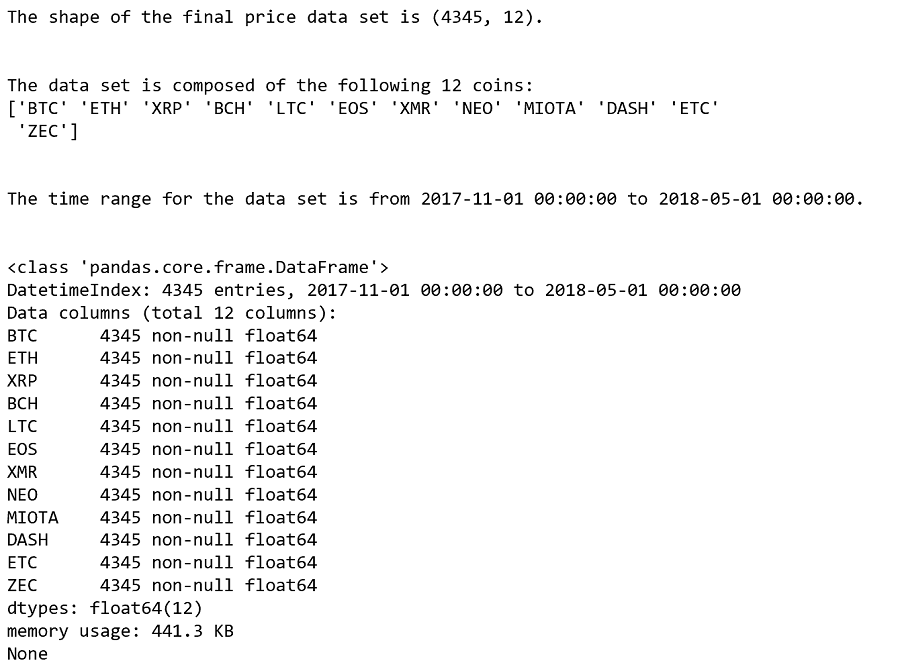
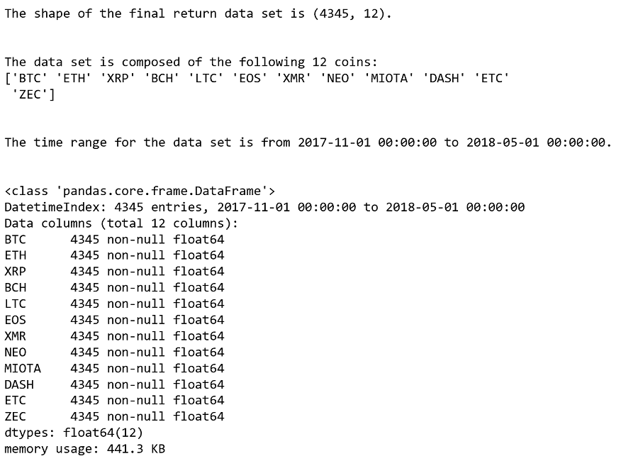

[](http://quantlet.de/)

## [](http://quantlet.de/) **FRM_3_Get_InputData** [](http://quantlet.de/)

```yaml


Name of QuantLet:   'FRM_3_Get_InputData'


Published in:       'DEDA_Class_2019WS'


Description:        '1) Retrieval of the hourly price data of cryptocurrencies via API call 
	             2) Calculation of the hourly returns 
	             3) Retrieval of the daily macro-economic variables via API call and transform it into an hourly data 
		     4) For macro Index S&P 500 and VIX, NaN (value on weekends and holidays) were filled with the value 
		        of previous the non NaN value'


Keywords:           'cryptocurrency, macro-economic index, data, hourly price, hourly return, weekly transformation, 
		     retrieval, API call'


Author:              Qi Wu, Seokhee Moon


Submitted:           Sun December 08 2019 by Qi Wu, Seokhee Moon


Input:               'S&P 500 Historical Data.csv,
		     vixcurrent.csv'

Output:              'Overall Information of the collected data in .PNG format,
		      macro1718_return.csv,
		      macro1718.csv,
		      1718hourlyReturn_withZEC.csv,
		      1718hourlyPrice_withZEC.csv'

```






### [IPYNB Code: FRM_3_Get_InputData.ipynb](FRM_3_Get_InputData.ipynb)


automatically created on 2020-01-31