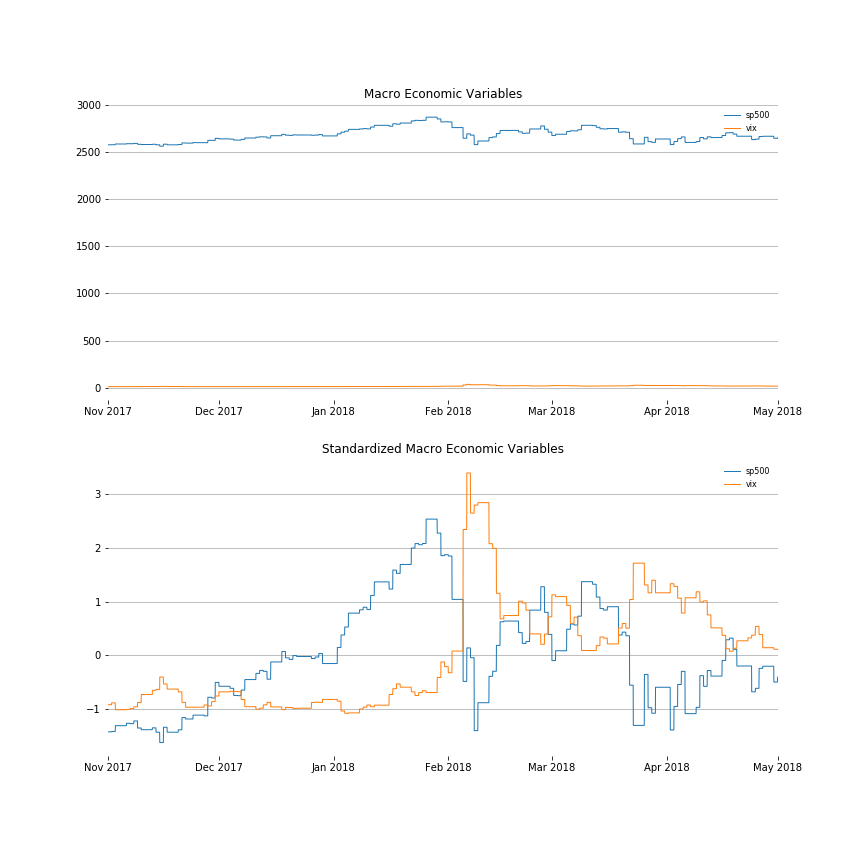
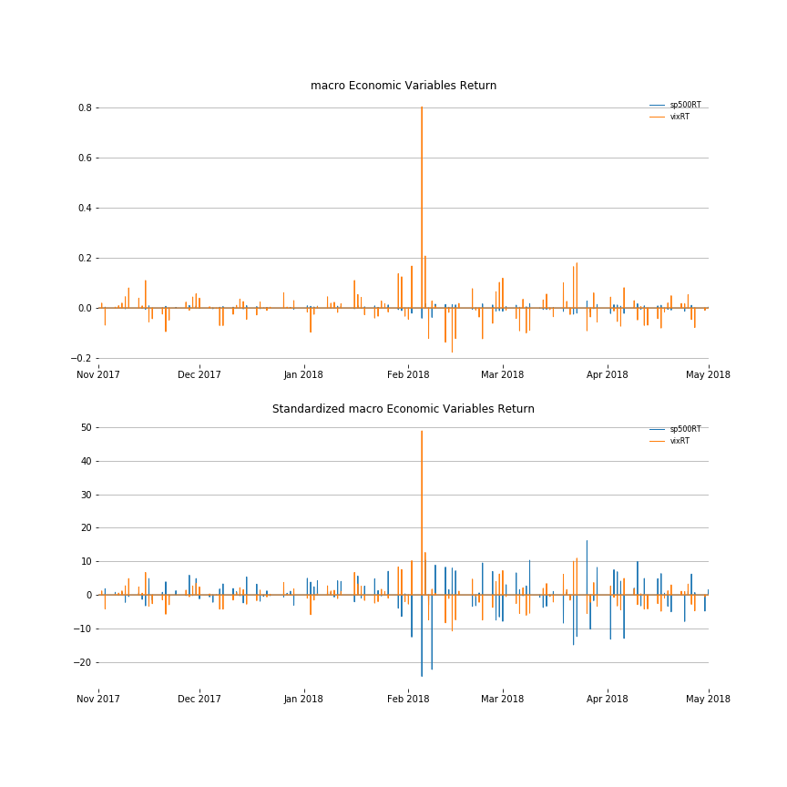
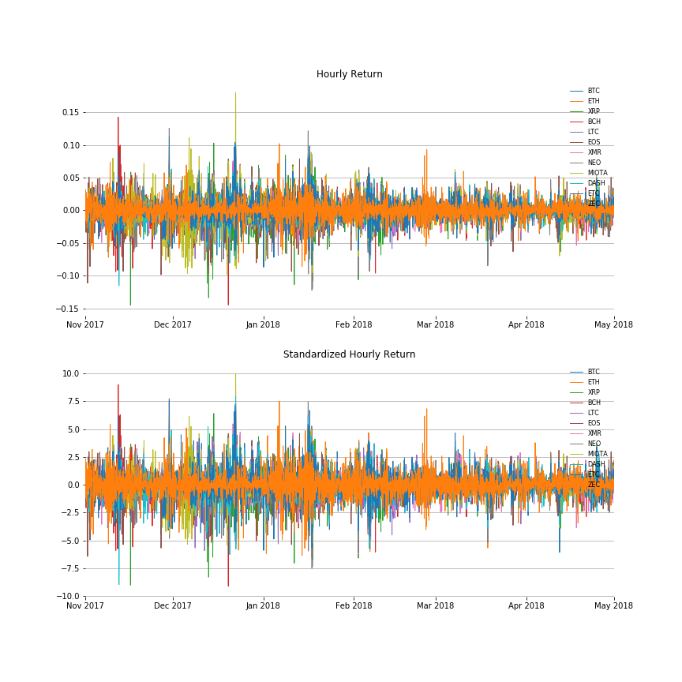

[](http://quantlet.de/)

## [](http://quantlet.de/) **FRM_4_Data_Analysis** [](http://quantlet.de/)

```yaml


Name of QuantLet:   'FRM_4_Data_Analysis'


Published in:       'DEDA_Class_2019WS'


Description:        'Analyze the price/return of the 12 coins and the 2 macro-economic indices'


Keywords:           data, analysis, normalization, standardization, log transformation


Author:             Qi Wu, Seokhee Moon


Submitted:          Sun, December 08 2019 by Qi Wu, Seokhee Moon

Input:              '1718hourlyPrice_withZEC.csv,
                     1718hourlyReturn_withZEC.csv,
                     macro1718_return.csv,
                     macro1718.csv'

Output:             'Data_Analysis in .PNG format,
                     Data_Analysis in .html format'

```








### [IPYNB Code: FRM_4_Data_Analysis.ipynb](FRM_4_Data_Analysis.ipynb)


automatically created on 2020-01-31